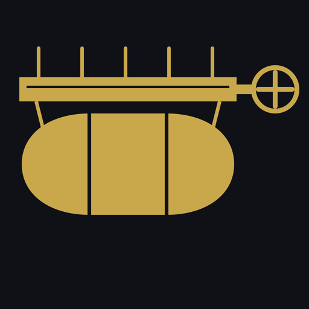

<p align="center">
  
</p>

# mhf-outpost

Launcher for Monster Hunter Frontier private servers.

mhf-outpost replaces the original Internet Explorer–based launcher for players
of [Erupe](https://github.com/Houmgaor/Erupe) servers: it signs in, lets you
pick a character, keeps the game files in sync with the server, applies
community translations, and boots the game directly — on Windows and, through
Wine, on Linux and the Steam Deck.

**mhf-outpost contains no game data.** The game files come from the server you
connect to, the same way the original launcher fetched them from Capcom's
patch server: the server publishes a manifest, the launcher downloads what is
missing or out of date. Which files a server provides, and on what terms, is
the server operator's business, not this project's.

Built with [Tauri 2](https://tauri.app) (Rust backend) and Vue 3 (frontend).

## What it does

- **Sign in** — login, registration and character selection against any
  Erupe-compatible server; the game only starts once a valid session token is
  in place, so it never sees your password.
- **Keep the game up to date** — per-file sync with the server's patch server
  (the same CRC32 manifest protocol the original launcher speaks). Only
  missing or changed files are downloaded, so a first install and a routine
  update are the same button. An empty folder is a valid starting point.
- **Translate** — fetches the community French/English translation payload
  from [MHFrontier-Translation](https://github.com/Mogapedia/MHFrontier-Translation)
  and patches it into the game files in place (ECD/JKR handled internally).
- **Launch without Internet Explorer** — loads the game engine directly from
  a session token; no IE, no `hosts` file, no GameGuard hooks.
- **Check the machine** — DirectX 9 / Wine + DXVK, Japanese fonts, game
  directory health, and a Windows Defender exclusion helper (`mhf.exe` is
  routinely flagged as malware).
- **Verify an install** — per-file SHA-256 manifests for every known client
  version, so a broken or tampered install is diagnosed rather than guessed at.

The `Advanced` path can also fetch a client version from a public
preservation archive when a manifest records one; that is for archivists and
server operators setting up a patch tree, not the everyday flow.

## Architecture

```
mhf-outpost (this)
    │  authenticate → session token in config.json
    │  sync         → game files from the server's patch tree
    ↓
bundled boot stub (32-bit)  ──→  mhfo-hd.dll / mhfo.dll
                                    (game takes over)

mhf-outpost ←──── Erupe server (auth API, patch server)
game        ←──── Erupe server (game protocol)
```

### Server side

An Erupe server advertises its patch server in `config.json`
(`API.PatchServer` for mhf-outpost, `PatchServerManifest`/`PatchServerFile`
for the original launcher). The layout is the one documented in
[Mezeporta/Servers](https://github.com/Mezeporta/Servers#mhf-patch-server-api):
a `mhfdat/{exe,dat}` tree plus a CRC32 manifest generated by `genMhfKey.py`,
served over plain HTTP.

```
GET http://<patch-server>/mhf_file.php?key=<n>          manifest
GET http://<patch-server>/mhfdat/<exe|dat>/<file>?id=<n> file
```

## Prerequisites

### Build tools

| Tool | Version | Notes |
|------|---------|-------|
| Rust | stable | via [rustup](https://rustup.rs) |
| Node.js | 20+ | |
| npm | 10+ | bundled with Node |

### Linux system libraries (for Tauri)

```bash
sudo apt-get install -y \
  libwebkit2gtk-4.1-dev libappindicator3-dev \
  librsvg2-dev patchelf libgtk-3-dev
```

### Windows

WebView2 runtime is required (pre-installed on Windows 10 1803+ and Windows 11).

## Development

```bash
npm install
npm run dev          # Vite dev server + Tauri dev window (hot reload)
```

## Building

```bash
npm run build        # Frontend only (dist/)
npm run tauri build  # Full Tauri release bundle (includes Rust backend)
```

The Rust core library and CLI can be built independently:

```bash
cargo build --release          # builds mhf-outpost CLI binary
cargo build --release --package mhf-launcher-app   # Tauri backend only
```

## CLI usage

The `mhf-outpost` binary exposes the full feature set without the GUI:

```bash
# Everyday flow: sign in, sync from the server, play
mhf-outpost login  --server http://frontier.example.com:8080 --username me --password '…' --path ~/mhf
mhf-outpost sync   --path ~/mhf --patch-server frontier.example.com
mhf-outpost launch --path ~/mhf

# Diagnostics
mhf-outpost check
mhf-outpost server-info --server http://frontier.example.com:8080
mhf-outpost verify --version zz --path ~/mhf
mhf-outpost translate --path ~/mhf --lang fr

# Archivists / server operators
mhf-outpost list
mhf-outpost info G10
mhf-outpost download --version G10 --path ~/mhf
mhf-outpost hash-dir ~/mhf          # generate manifest hashes
```

## Manifests

Each known game version has a TOML manifest in `manifests/` with per-file
SHA-256 hashes, used by `verify` to tell a healthy install from a broken one.
File kinds control how verification failures are classified:

| Kind | Meaning |
|------|---------|
| `core` | Game executable / DLL — any modification is an error |
| `url` | Server URL lists — expected to differ for community servers |
| `translation` | Game data files — expected to differ for fan translations |
| `config` | User config / save data — always user-specific |

A manifest may additionally record a public preservation archive as an
`[archive]` source; `download` uses it when present.

## Related projects

| Project | Role |
|---------|------|
| [Erupe](https://github.com/Houmgaor/Erupe) | Server emulator (sign, entrance, channel servers, API) |
| [MHFrontier-Translation](https://github.com/Mogapedia/MHFrontier-Translation) | Community translations applied by `translate` |

## Legal

mhf-outpost is an independent, open-source launcher. It is not affiliated with
or endorsed by Capcom. Monster Hunter Frontier and its game files are
© Capcom Co., Ltd.; this repository distributes none of them. The launcher is
a client: it downloads whatever the server you choose to connect to makes
available. Running a server, and deciding what it serves, is the operator's
responsibility.

## License

[MIT](LICENSE)
